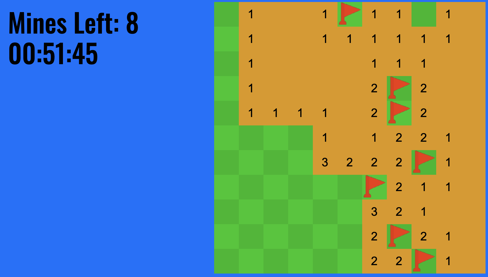

# olinjohnson/Minesweeper-game-clone
#### This is a clone of the game Minesweeper



## Running the program
To run it, you need to have Node.js installed. 
Install dependencies with ```npm install -S``` and then run with ```node main```.

## A few problems that need fixing...
Filling an empty board full with flags will let you win. \
Uncovering all safe squares in order to win needs to be added. \
If an "empty tile" expands and there are flags in the way, then it doesn't remove the flags.
